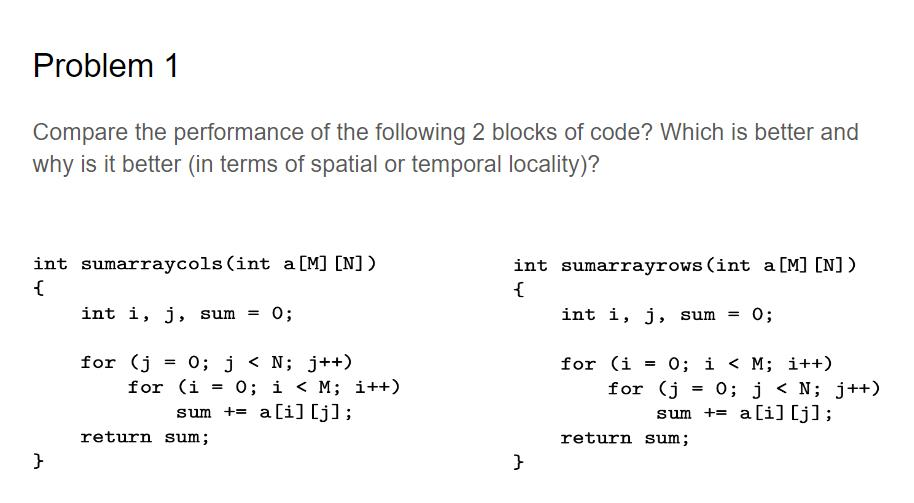
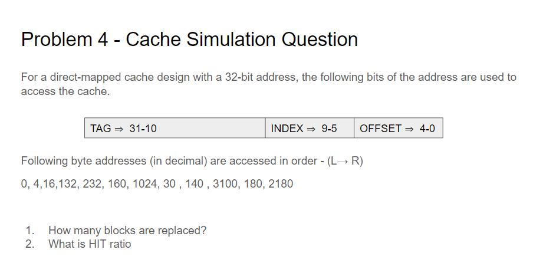

[Link to the Discussion Slides](https://docs.google.com/presentation/d/1Po9d8ZqYFPpps0HGYvTTO3bjtuLHNrGeIvf6bRtOPwc/edit?usp=sharing)

## Problem 1:



> Hint: Try analysing the access patterns
> 2D arrays map out as 1-D array in a Row-wise fashion
>
> Which of the 2 access patterns better exploit the principle of locality?

row access more efficient than column access

## Problem 2:

Assuming a cache of 4096 blocks, a 4-word block size, and a 32-bit address, find the total number of sets and the total number of tag bits for caches that are direct mapped, two-way and four-way set associative, and fully associative.

> Number of offset bits = log_2(Block Size)
>
> Number of sets = Cache size / (Block Size \* Set associativity)
>
> Number of index bits = log_2(Number of sets)
>
> Number of tag bits = Number of address bits - Number of Tag bits - Number of offset bits

> 1 word = 4 bytes => 4 words = 16 bytes

```c
2 way set associative cache

Number of offset bits = log_2(4*4) = 4
Number of sets = 4096 / 2 = 2048
Number of index bits = log_2(2048) = 11 bits
Number of tag bits = 32-11-4 = 17 bits

Tag = 32-12-4= 17
Index = 11
Offset = 4

```

## Problem 3

Consider a cache with 64 blocks and a block size of 16 bytes. To what block number does byte address 1200 map? Where set does this address map to in the cache? Where set does this adress map to in the cache?

```c
1200 ( 0100 1011 0000)

First of all, we know the entry into the cache is given by
Where the block address is given by

So, the block address is 1200/16 = 75.

//block number
This corresponds to block number 75 % 64 = 11.

This block maps all addresses between 1200 and 1215.

Block 0: 0-15 --> Set 0
Block 1: 16-31 --> Set 1
Block 2: 32-47 --> Set 2
...
Block 11: 1200-1215 --> Set 11

*Block Address modulo Number of clocks in the cache*

Address 1200 => 75th block address => 11th block in Cache
```

## Problem 4



Note that the question says BYTE ADDRESSES and not BOCK ADDRESSES

Also note that the addresses given are in decimal/ base 10!
