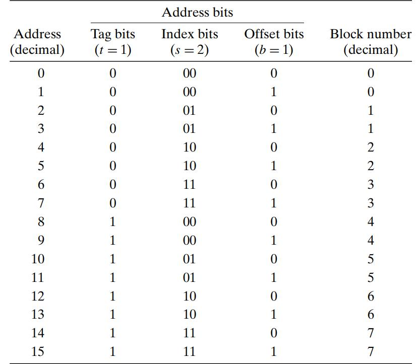
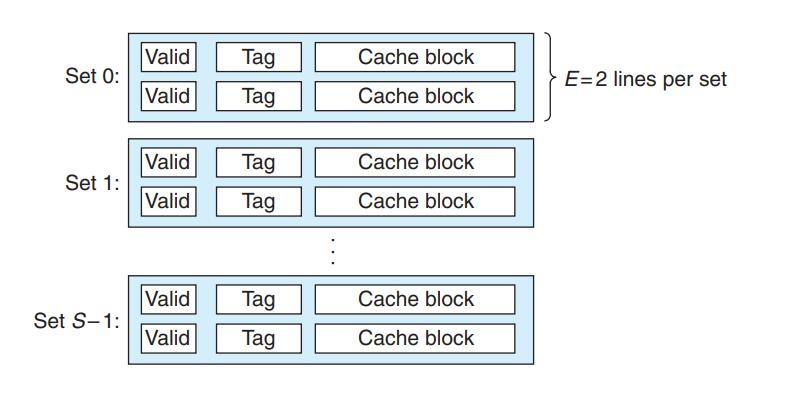
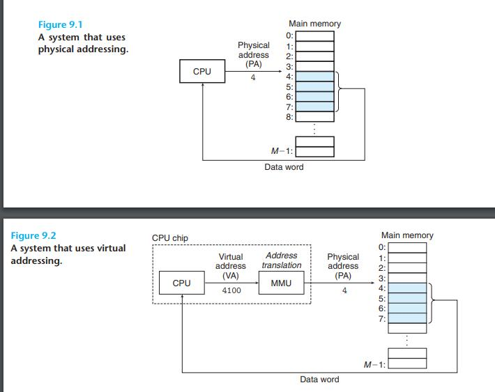
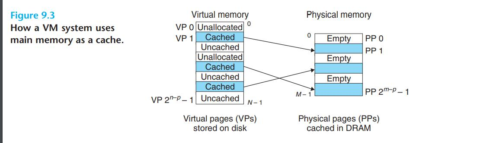
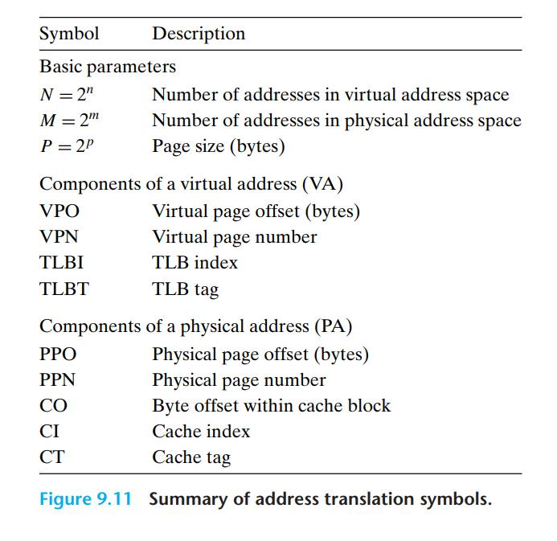

# Notes on Computer Architecture

**Reading notes of Computer Organization and Design - The Hardware/Software Interface (Arm Edition)**

# Table of Content

**Week 1:**

- [Chapter 1.6 Performance](#chapter-16)
- [Chapter 1.10 Fallacies and Pitfalls](#chapter-110-fallacies-and-pitfalls)
- [Week 1 Lecture 2](./09-27.md)
- [Week 1 Lecture 3](./09-29.md)
- [Week 1 CSE 142L](./09-30-142L.md)
- [Week 1 Discussion](Week%201%20DI.md)

**Week 2:**

- [Section Sections 6, 7.1-7.5, and 7.7 of the DIS (Dive into Systems) text](#sections-6-71-75-and-77-of-the-dis-dive-into-systems-text)
- [Section 6.2, 6.3 of Computer Systems](#sections-62-and-63-of-the-bryant-computer-systems-a-programmers-perspective-text)
- [Week 2 Lecture 4](10-04.md)
- [Week 2 Lecture 5](./10-06.md)
- [Week 2 CSE 142L](./10-07-142L.md))
- [Week 2 Discussion](Week%201%20DI.md)

**Week 3:**

- [Section 6.4 (stopping at 6.4.3) of the Bryant (Computer Systems: A Programmer's Perspective) ](#section-64-stopping-at-643-of-the-bryant-computer-systems-a-programmers-perspective)
- [Section 6.4 (6.4.3-end) of the Bryant (Computer Systems: A Programmer's Perspective)](#section-64-643-end-of-the-bryant-computer-systems-a-programmers-perspective)

**Week 3:**

- [9.1-9.5 and 9.6.2 of the Bryant (Computer Systems: A Programmer's Perspective)]
-

# Chapter 1.6

## Response time

Also called execution time.

- The total time required for the computer to complete a task, including disk accesses, memory accesses, I/O activities, operating system overhead, CPU execution time, and so on.

## throughput

Also called bandwidth

- Another measure of performance, number of tasks completed per unit tim

## Performance and Execution time

To maximize performance, we want to
minimize response time or execution time for some task. Thus, we can relate
performance and execution time for a computer X:


> Example, if A runs a program in 10 seconds, B runs the same program in 15 seconds, how much faster is A than B?
>
> Performance_A / Performance_B = Time_B / Time_A = 15/10 = 1.5

## CPU time

- user CPU time
  - The actual CPU time spent in a program itself
- system CPU time
  - The CPU time spent in the operating system performing tasks on behalf of the program

## CPU Performance

refer to the user CPU time

## Clock cycle

also called tick, clock tick, clock period, clock, or cycle

- The time for one clock period, usually of the process clock, which runs at a constant rate.

## Clock period

The length of each clock cycle

## CPU Performance and its factors


## Instruction performance


## Clock cycles per instruction (CPI)

Average number of clock cycles per instruction for a program or program fragment

> Example:
> Suppose we have two implementations of the same instruction set architecture.
> Computer A has a clock cycle time of 250 ps and a CPI of 2.0 for some program,
> and computer B has a clock cycle time of 500 ps and a CPI of 1.2 for the same
> program. Which computer is faster for this program and by how much?


## The Classic CPU Performance Equation

## Instruction count

The number of instructions executed by the program

## New formula


These formulas are particularly useful because they separate the three key factors
that affect performance. We can use these formulas to compare two differen
implementations or to evaluate a design alternative if we know its impact on these
three parameters.

> Example:
> 

## Instruction Mix

A measure of the dynamic frequency of instructios across one or many programs

## Understanding program performance

The performance of a program depends on the algorithm, the language, the
compiler, the architecture, and the actual hardware. The following table summarizes
how these components affect the factors in the CPU performance equation


> Choose B

# Chapter 1.10 Fallacies and Pitfalls

Pitfall

- Easily made mistakes
- Expecting the improvement of one aspect of a computer to increase overall performance by an amount proportional to the size of the improvement.
- Pitfall: Using a subset of the performance equation as a performance metric.

Fallacy

- Designing for performance and designing for energy efficiency ar
  unrelated goals.

## Amdahl’s Law

A rule stating that
the performance
enhancement possible
with a given improvement
is limited by the amount
that the improved feature
is used. It is a quantitative
version of the law of
diminishing returns.
Science must begin
with myths, and the
criticism of myths.
Sir Karl Popper, The
Philosophy of Science,
1957

> A simple design problem illustrates it well. Suppose a program runs in 100
> seconds on a computer, with multiply operations responsible for 80 seconds of this
> time. How much do I have to improve the speed of multiplication if I want my
> program to run five times faster?
>
>  > 
> That is, there is no amount by which we can enhance-multiply to achieve a fivefol
> increase in performance, if multiply accounts for only 80% of the workload. The
> performance enhancement possible with a given improvement is limited by the amount
> that the improved feature is used. In everyday life this concept also yields what we call
> the law of diminishing returns.

One alternative to time is MIPS (million instructions per second).

## million instructions per second (MIPS)

A measurement of
program execution speed
based on the number of
millions of instructions.
MIPS is computed as the
instruction count divided
by the product of the
execution time and 106


There are three problems with using MIPS as a measure for comparing computers.

- First, MIPS specifies the instruction execution rate but does not take into account
  the capabilities of the instructions. We cannot compare computers with different
  instruction sets using MIPS, since the instruction counts will certainly differ.

- Second, MIPS varies between programs on the same computer; thus, a computer
  cannot have a single MIPS rating.

For example, by substituting for execution time,
we see the relationship between MIPS, clock rate, and CPI:


## Sections 6, 7.1-7.5, and 7.7 of the DIS (Dive into Systems) text

### 6. Under the C: Diving into Assembly

Higher-Level Abstraction Hides Valuable Program Details

As an example, take a look at the following program:

```C
#include <stdio.h>

int adder() {
    int a;
    return a + 2;
}

int assign() {
    int y = 40;
    return y;
}

int main() {
    int x;
    assign();
    x = adder();
    printf("x is: %d\n", x);
    return 0;
}

$ gcc -o example example.c
$ ./example
x is: 42
```

Each of these different flavors of assembly implement different instruction set architectures (ISAs). Recall that an ISA defines the set of instructions and their binary encoding, the set of CPU registers, and the effects of executing instructions on the state of the CPU and memory.

CPU registers are used as operands of many instructions, and that each ISA provides similar types of instructions:

- instructions for computing arithmetic and logic operations, such as addition or bitwise AND

- instructions for control flow that are used to implement branching such as if-else, loops, and function call and return

- instructions for data movement that load and store values between CPU registers and memory

- instructions for pushing and popping values from the stack. These instructions are used to implement the execution call stack, where a new frame of stack memory (that stores a running function’s local variables and parameters) is added to the top of the stack on a function call, and a frame is removed from the top of the stack on a function return.

A C compiler translates C source code to a specific ISA instruction set. The compiler translates C statements, including loops, if-else, function calls, and variable access, to a specific set of instructions that are defined by the ISA and implemented by a CPU that is designed to execute instructions from the specific ISA. For example, a compiler translates C to x86 instructions for execution on an Intel x86 processor, or translates C to ARM instructions for execution on an ARM processor.

### 64-bit x86 Assembly (x86-64)

### 7.1. Diving into Assembly: Basics

For a first look at x64 assembly, we modify the adder function from Chapter 6 to simplify its behavior. The modified function (adder2) is shown below:

```C
#include <stdio.h>

//adds two to an integer and returns the result
int adder2(int a) {
    return a + 2;
}

int main(){
    int x = 40;
    x = adder2(x);
    printf("x is: %d\n", x);
    return 0;
}
```

To compile this code, use the following command:

```C
$ gcc -o adder adder.c
```

Next, let’s view the corresponding assembly of this code by using the `objdump command`:

$ objdump -d adder > output
$ less output

### 7.1.1

7.1.1. Registers
Recall that a register is a word-sized storage unit located directly on the CPU. There may be separate registers for data, instructions, and addresses. For example, the Intel CPU has a total of 16 registers for storing 64-bit data:

%rax, %rbx, %rcx, %rdx, %rdi, %rsi, %rsp, %rbp, and %r8-%r15. All the registers save for %rsp and %rbp hold general-purpose 64-bit data. While a program may interpret a register’s contents as, say, an integer or an address, the register itself makes no distinction. Programs can read from or write to all sixteen registers.

# Sections 6.2 and 6.3 of the Bryant (Computer Systems: A Programmer's Perspective) text

## 6.2 Locality

Locality is typically described as having two distinct forms: temporal locality and spatial locality.

- In a program with good temporal locality, a memory location
  that is referenced once is likely to be referenced again multiple times in the near future.
- In a program with good spatial locality, if a memory location is referenced once, then the program is likely to reference a nearby memory location in the near
  future.

Programmers should understand the principle of locality because, in general,programs with good locality run faster than programs with poor locality.

## 6.3 The Memory Hierarchy

- Storage technology.
  - Different storage technologies have widely different access times. Faster technologies cost more per byte than slower ones and have less capacity. The gap between CPU and main memory speed is widening.
- Computer software.
  - Well-written programs tend to exhibit good locality
    

In general, the storage devices get slower, cheaper, and larger as we move from higher to lower levels.

- At the highest level (L0) are a small number of fast
  CPU registers that the CPU can access in a single clock cycle.
- Next are one or more small to moderate-size SRAM-based cache memories that can be accessed in a few CPU clock cycles. These are followed by a large DRAM-based main
  memory that can be accessed in tens to hundreds of clock cycles.
- Next are slow but enormous local disks.
- Finally, some systems even include an additional level
  of disks on remote servers that can be accessed over a network. For example, distributed file systems such as the Andrew File System (AFS) or the Network File System (NFS) allow a program to access files that are stored on remote
  network-connected servers. Similarly, the World Wide Web allows programs to access remote files stored on Web servers anywhere in the world.

## 6.3.1 Caching in the Memory Hierarchy

In general, a cache (pronounced “cash”) is a small, fast storage device that acts as
a staging area for the data objects stored in a larger, slower device. The process of
using a cache is known as caching (pronounced “cashing”)

The central idea of a memory hierarchy is that for each k, the faster and smaller
storage device at level k serves as a cache for the larger and slower storage device at level k + 1. In other words, each level in the hierarchy caches data objects from
the next lower level. For example, the local disk serves as a cache for files (such
as Web pages) retrieved from remote disks over the network, the main memory
serves as a cache for data on the local disks, and so on, until we get to the smallest
cache of all, the set of CPU registers

# Section 6.4 (stopping at 6.4.3) of the Bryant (Computer Systems: A Programmer's Perspective)

Consider a computer system where each memory address has m bits that form
`M = 2m` unique addresses. As illustrated in Figure 6.25(a), a cache for such a
machine is organized as an array of `S = 2s` cache sets. Each set consists of E cache
lines. Each line consists of a data block of B = 2b bytes, a valid bit that indicates
whether or not the line contains meaningful information, and `t = m − (b + s)` tag
bits (a subset of the bits from the current block’s memory address) that uniquely identify the block stored in the cache line.

## General organization of cache (S, E, B, m).

(a) A cache is an array
of sets. Each set contains
one or more lines. Each
line contains a valid bit,
some tag bits, and a block
of data.

(b) The cache
organization induces a
partition of the `m` address
bits into `t `tag bits, `s` set
index bits, and `b` block
offset bits.

> . The concatenation of the tag and index bits uniquely identifies each block in
> memory. For example, block 0 consists of addresses 0 and 1, block 1 consists
> of addresses 2 and 3, block 2 consists of addresses 4 and 5, and so on.
> . Since there are eight memory blocks but only four cache sets, multiple blocks
> map to the same cache set (i.e., they have the same set index). For example,
> blocks 0 and 4 both map to set 0, blocks 1 and 5 both map to set 1, and so on.
> . Blocks that map to the same cache set are uniquely identified by the tag. For
> example, block 0 has a tag bit of 0 while block 4 has a tag bit of 1, block 1 has
> a tag bit of 0 while block 5 has a tag bit of 1, and so on.

## 6.4.2 Direct-Mapped Caches

. Conflict misses in direct-mapped caches typically occur when programs
access arrays whose sizes are a power of 2.

> Example: A: 10100 B: 10110 Yes

In a direct-mapped cache with 4 blocks, the indexing will just use the 2 least-significant bits of the block address (since we need two bits to count the 4 blocks 0, 1, 2, and 3). Therefore conflicts will only occur when the 2 least-significant bits of the addresses are the same. Here, A maps to cache block 0 and B maps to cache block 2, so there is no conflict.

> A: 11011 B: 01001 Yes
>
> In a direct-mapped cache with 4 blocks, the indexing will just use the 2 least-significant bits of the block address (since we need two bits to count the 4 blocks 0, 1, 2, and 3). Therefore conflicts will only occur when the 2 least-significant bits of the addresses are the same. Here, A maps to cache block 3 and B maps to cache block 1, so there is no conflict.

> A: 00101 B: 11001 No
>
> In a direct-mapped cache with 4 blocks, the indexing will just use the 2 least-significant bits of the block address (since we need two bits to count the 4 blocks 0, 1, 2, and 3). Therefore conflicts will occur when the 2 least-significant bits of the addresses are the same. Here, A maps to cache block 1 and B also maps to cache block 1, so they conflict.



# Section 6.4 (6.4.3-end) of the Bryant (Computer Systems: A Programmer's Perspective)

## Set associative cache

(1 < E < C/B). In a set associative cache, each set contains more than one line. This particular example shows a two-way set associative cache.



## 6.4.7 Performance Impact of Cache Parameters

Cache performance is evaluated with a number of metrics:

`Miss rate`

- The fraction of memory references during the execution of a program, or a part of a program, that miss. It is computed as `#` misses`/` references.

`Hit rate.`

- The fraction of memory references that hit. It is computed as 1 − miss rate.

`Hit time.`

- The time to deliver a word in the cache to the CPU, including the time for set selection, line identification, and word selection. Hit time is on the
  order of several clock cycles for L1 caches

## Impact of Cache Size

On the one hand, a larger cache will tend to increase the hit rate. On the other hand, it is always harder to make large memories run faster. As a result, larger caches tend to increase the hit time. This explains why an L1 cache is smaller than an L2 cache, and an L2 cache is smaller than an L3 cache.

## Impact of Block Size

Large blocks are a mixed blessing. On the one hand, larger blocks can help increase the hit rate by exploiting any spatial locality that might exist in a program.
However, for a given cache size, larger blocks imply a smaller number of cache lines, which can hurt the hit rate in programs with more temporal locality than spatial locality. Larger blocks also have a negative impact on the miss penalty,
since larger blocks cause larger transfer times. Modern systems such as the Core i7 compromise with cache blocks that contain 64 bytes.

## Impact of Associativity

The issue here is the impact of the choice of the parameter E, the number of cache lines per set. The advantage of higher associativity (i.e., larger values of E) is that it decreases the vulnerability of the cache to thrashing due to conflict misses. However, higher associativity comes at a significant cost. Higher associativity is
expensive to implement and hard to make fast. It requires more tag bits per
line, additional LRU state bits per line, and additional control logic. Higher
associativity can increase hit time, because of the increased complexity, and it can
also increase the miss penalty because of the increased complexity of choosing a
victim line.
The choice of associativity ultimately boils down to a trade-off between the
hit time and the miss penalty. Traditionally, high-performance systems that pushed
the clock rates would opt for smaller associativity for L1 caches (where the miss
penalty is only a few cycles) and a higher degree of associativity for the lower
levels, where the miss penalty is higher. For example, in Intel Core i7 systems, the
L1 and L2 caches are 8-way associative, and the L3 cache is 16-way.

## Impact of Write Strategy

Write-through caches are simpler to implement and can use a write buffer that works independently of the cache to update memory. Furthermore, read misses are less expensive because they do not trigger a memory write.
On the other
hand, write-back caches result in fewer transfers, which allows more bandwidth
to memory for I/O devices that perform DMA. Further, reducing the number of
transfers becomes increasingly important as we move down the hierarchy and the
transfer times increase. In general, caches further down the hierarchy are more
likely to use write-back than write-through

## Aside Cache lines, sets, and blocks: What’s the difference?

It is easy to confuse the distinction between cache lines, sets, and blocks. Let’s review these ideas and
make sure they are clear:

- A block is a fixed-size packet of information that moves back and forth between a cache and main
  memory (or a lower-level cache).
- A line is a container in a cache that stores a block, as well as other information such as the valid
  bit and the tag bits.
- A set is a collection of one or more lines. Sets in direct-mapped caches consist of a single line. Sets
  in set associative and fully associative caches consist of multiple lines.

In direct-mapped caches, sets and lines are indeed equivalent. However, in associative caches, sets and
lines are very different things and the terms cannot be used interchangeably.

Since a line always stores a single block, the terms “line” and “block” are often used interchangeably. For example, systems professionals usually refer to the “line size” of a cache, when what they really mean is the block size. This usage is very common and shouldn’t cause any confusion as long as you understand the distinction between blocks and lines.

> Readin quiz 10/13
> Match the types of caches to their descriptions, assuming a cache that can hold 16 data blocks.
> !

- Direct-mapped cache
  - Any particular data block can be stored in only one location in the cache
- 4-way set associative cache
  - Any particular data block can be stored in one of 4 locations in the cache
- Fully associative cache
  - Any particular data block can be stored in one of 16 locations (any location) in the cache
- 2-way set associative cache
  - Any particular data block can be stored in one of 2 locations in the cache
- 8-way set associative cache
  - Any particular data block can be stored in one of 8 locations in the cache

# 6.5 Writing Cache-Friendly Code

## Cache friendly, in the sense that it has good locality.

Here is the basic approach we use to try to ensure that our code is cache friendly.

1. Make the common case go fast. Programs often spend most of their time in a few core functions. These functions often spend most of their time in a few loops. So focus on the inner loops of the core functions and ignore the rest.
2. Minimize the number of cache misses in each inner loop.All other things being
   equal, such as the total number of loads and stores, loops with better miss rates
   will run faster.

# 9.1-9.5 and 9.6.2 of the Bryant (Computer Systems: A Programmer's Perspective)

## 9.1 Physical and Virtual Addressing

The main memory of a computer system is organized as an array of M contiguous
byte-size cells. Each byte has a unique physical address (PA). The first byte has
an address of 0, the next byte an address of 1, the next byte an address of 2,
and so on. Given this simple organization, the most natural way for a CPU to
access memory would be to use physical addresses. We call this approach physical
addressing. Figure 9.1 shows an example of physical addressing in the context of
a load instruction that reads the 4-byte word starting at physical address 4. When
the CPU executes the load instruction, it generates an effective physical address
and passes it to main memory over the memory bus. The main memory fetches the
4-byte word starting at physical address 4 and returns it to the CPU, which stores
it in a register.

Early PCs used physical addressing, and systems such as digital signal processors, embedded microcontrollers, and Cray supercomputers continue to do so.

**However, modern processors use a form of addressing known as virtual addressing, as shown in Figure 9.2.**



> With virtual addressing, the CPU accesses main memory by generating a virtual address (VA), which is converted to the appropriate physical address before
> being sent to main memory. The task of converting a virtual address to a physical
> one is known as **address translation**.

Like exception handling, address translation
requires close cooperation between the CPU hardware and the operating system. Dedicated hardware on the CPU chip called the memory management unit
(MMU)translates virtual addresses on the fly, using a lookup table stored in main
memory whose contents are managed by the operating system.

## 9.2 Address Spaces

An address space is an ordered set of nonnegative integer addresses
`{0, 1, 2,...}`

If the integers in the address space are consecutive, then we say that it is a linear
address space. To simplify our discussion, we will always assume linear address
spaces.

In a system with virtual memory, the CPU generates virtual addresses from
an address space of `N = 2^n` addresses called the virtual address space:
`{0, 1, 2,...,N − 1}`

The size of an address space is characterized by the number of bits that are
needed to represent the largest address. For example, a virtual address space
with `N = 2^n` addresses is called an n-bit address space. Modern systems typically
support either 32-bit or 64-bit virtual address spaces.

A system also has a physical address space that corresponds to the `M` bytes of
physical memory in the system:
`{0, 1, 2,...,M − 1}`

## 9.3 VM as a Tool for Caching

Conceptually, a virtual memory is organized as an array of N contiguous byte-size
cells stored on disk. Each byte has a unique virtual address that serves as an index
into the array. The contents of the array on disk are cached in main memory. As
with any other cache in the memory hierarchy, the data on disk (the lower level)
is partitioned into blocks that serve as the transfer units between the disk and
the main memory (the upper level). VM systems handle this by partitioning the
virtual memory into fixed-size blocks called virtual pages (VPs).

Each virtual page
is `P = 2^p` bytes in size. Similarly, physical memory is partitioned into physical pages
(PPs), also P bytes in size. (Physical pages are also referred to as page frames.)
At any point in time, the set of virtual pages is partitioned into three disjoint
subsets:

- Unallocated. Pages that have not yet been allocated (or created) by the VM
  system. Unallocated blocks do not have any data associated with them,
  and thus do not occupy any space on disk.
- Cached. Allocated pages that are currently cached in physical memory.
- Uncached. Allocated pages that are not cached in physical memory
  

## 9.4 VM as a Tool for Memory Management

## 9.5 VM as a Tool for Memory Protection

## 9.6 Address Translation


