# Notes on Computer Architecture

**Reading notes of Computer Organization and Design - The Hardware/Software Interface (Arm Edition)**

# Table of Content

- [Chapter 1.6 Performance](#chapter-16)
  - [Week 1 Lecture 2](./09-27.md)
- [Chapter 1.10 Fallacies and Pitfalls](#chapter-110-fallacies-and-pitfalls)
  - [Week 2 Lecture 3]()
- [Week 1 142L](09-29.md)
- [Week 1 Discussion](Week%201%20DI.md)

# Chapter 1.6

## Response time

Also called execution time.

- The total time required for the computer to complete a task, including disk accesses, memory accesses, I/O activities, operating system overhead, CPU execution time, and so on.

## throughput

Also called bandwidth

- Another measure of performance, number of tasks completed per unit tim

## Performance and Execution time

To maximize performance, we want to
minimize response time or execution time for some task. Thus, we can relate
performance and execution time for a computer X:

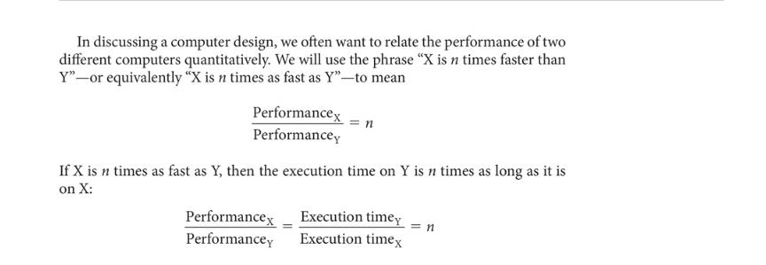
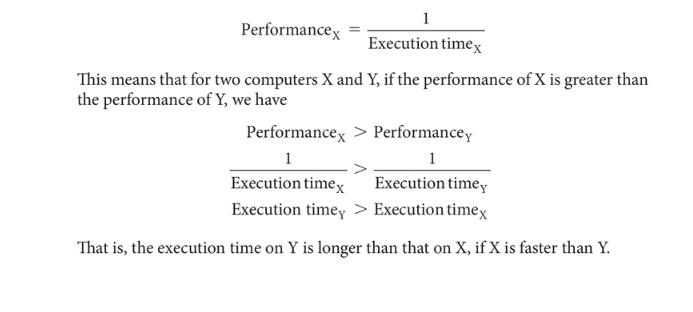

> Example, if A runs a program in 10 seconds, B runs the same program in 15 seconds, how much faster is A than B?
>
> Performance_A / Performance_B = Time_B / Time_A = 15/10 = 1.5

## CPU time

- user CPU time
  - The actual CPU time spent in a program itself
- system CPU time
  - The CPU time spent in the operating system performing tasks on behalf of the program

## CPU Performance

refer to the user CPU time

## Clock cycle

also called tick, clock tick, clock period, clock, or cycle

- The time for one clock period, usually of the process clock, which runs at a constant rate.

## Clock period

The length of each clock cycle

## CPU Performance and its factors

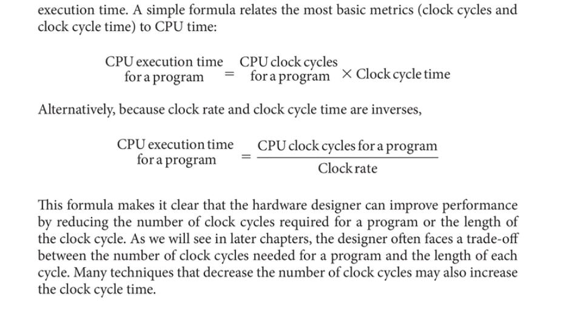

## Instruction performance

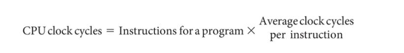

## Clock cycles per instruction (CPI)

Average number of clock cycles per instruction for a program or program fragment

> Example:
> Suppose we have two implementations of the same instruction set architecture.
> Computer A has a clock cycle time of 250 ps and a CPI of 2.0 for some program,
> and computer B has a clock cycle time of 500 ps and a CPI of 1.2 for the same
> program. Which computer is faster for this program and by how much?

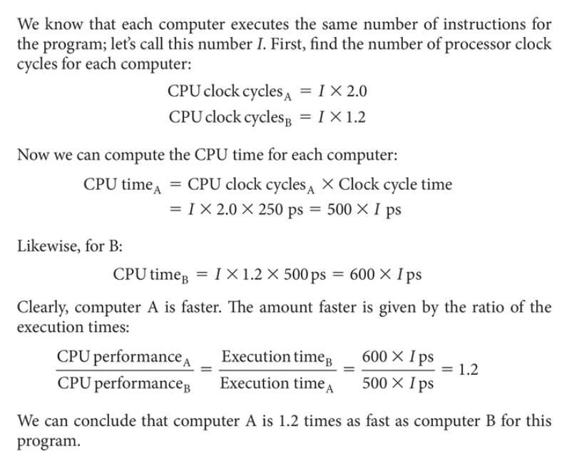

## The Classic CPU Performance Equation

## Instruction count

The number of instructions executed by the program

## New formula

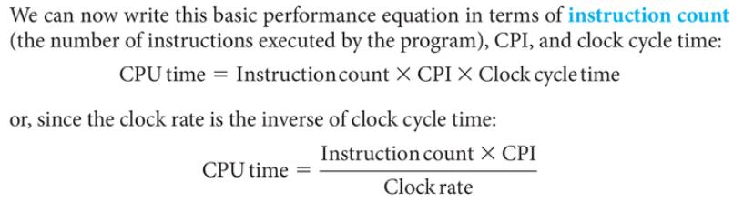
These formulas are particularly useful because they separate the three key factors
that affect performance. We can use these formulas to compare two differen
implementations or to evaluate a design alternative if we know its impact on these
three parameters.

> Example:
> 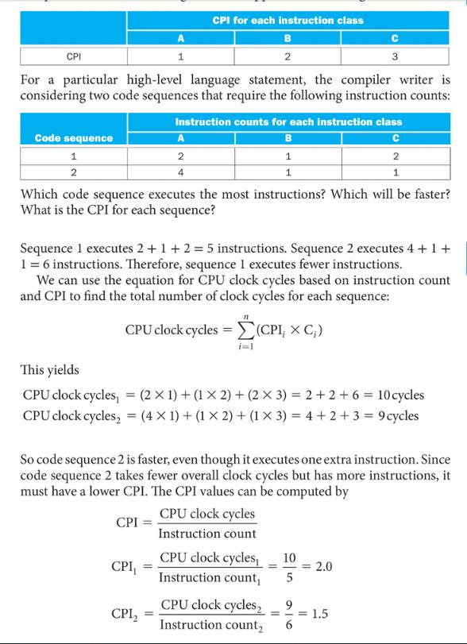

## Instruction Mix

A measure of the dynamic frequency of instructios across one or many programs

## Understanding program performance

The performance of a program depends on the algorithm, the language, the
compiler, the architecture, and the actual hardware. The following table summarizes
how these components affect the factors in the CPU performance equation
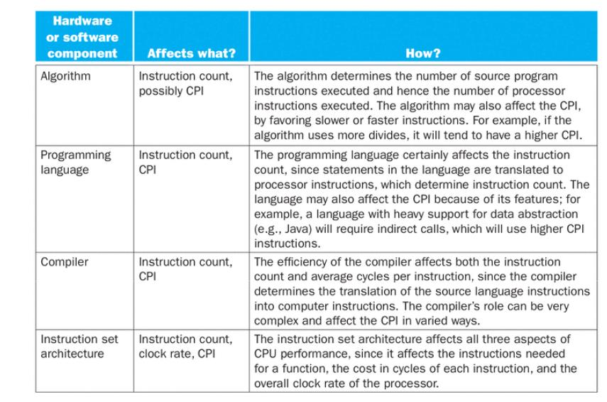

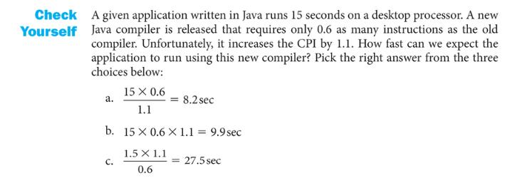

> Choose B

# Chapter 1.10 Fallacies and Pitfalls

Pitfall

- Easily made mistakes
- Expecting the improvement of one aspect of a computer to increase overall performance by an amount proportional to the size of the improvement.
- Pitfall: Using a subset of the performance equation as a performance metric.

Fallacy

- Designing for performance and designing for energy efficiency ar
  unrelated goals.

## Amdahl’s Law

A rule stating that
the performance
enhancement possible
with a given improvement
is limited by the amount
that the improved feature
is used. It is a quantitative
version of the law of
diminishing returns.
Science must begin
with myths, and the
criticism of myths.
Sir Karl Popper, The
Philosophy of Science,
1957

> A simple design problem illustrates it well. Suppose a program runs in 100
> seconds on a computer, with multiply operations responsible for 80 seconds of this
> time. How much do I have to improve the speed of multiplication if I want my
> program to run five times faster?
>
> 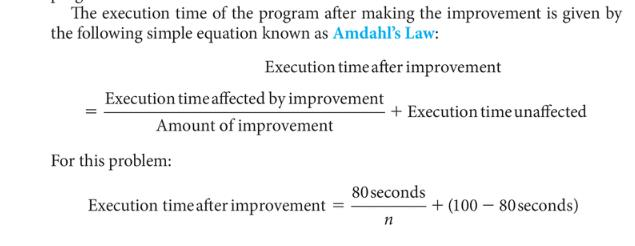 > 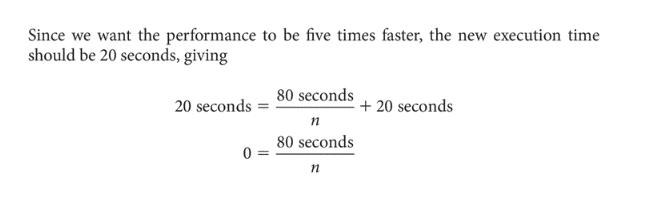
> That is, there is no amount by which we can enhance-multiply to achieve a fivefol
> increase in performance, if multiply accounts for only 80% of the workload. The
> performance enhancement possible with a given improvement is limited by the amount
> that the improved feature is used. In everyday life this concept also yields what we call
> the law of diminishing returns.

One alternative to time is MIPS (million instructions per second).

## million instructions per second (MIPS)

A measurement of
program execution speed
based on the number of
millions of instructions.
MIPS is computed as the
instruction count divided
by the product of the
execution time and 106
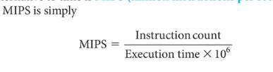

There are three problems with using MIPS as a measure for comparing computers.

- First, MIPS specifies the instruction execution rate but does not take into account
  the capabilities of the instructions. We cannot compare computers with different
  instruction sets using MIPS, since the instruction counts will certainly differ.

- Second, MIPS varies between programs on the same computer; thus, a computer
  cannot have a single MIPS rating.

For example, by substituting for execution time,
we see the relationship between MIPS, clock rate, and CPI:

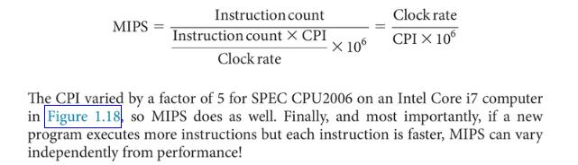

## Sections 6, 7.1-7.5, and 7.7 of the DIS (Dive into Systems) text

### 6. Under the C: Diving into Assembly

Higher-Level Abstraction Hides Valuable Program Details

As an example, take a look at the following program:

```C
#include <stdio.h>

int adder() {
    int a;
    return a + 2;
}

int assign() {
    int y = 40;
    return y;
}

int main() {
    int x;
    assign();
    x = adder();
    printf("x is: %d\n", x);
    return 0;
}

$ gcc -o example example.c
$ ./example
x is: 42
```

Each of these different flavors of assembly implement different instruction set architectures (ISAs). Recall that an ISA defines the set of instructions and their binary encoding, the set of CPU registers, and the effects of executing instructions on the state of the CPU and memory.

CPU registers are used as operands of many instructions, and that each ISA provides similar types of instructions:

- instructions for computing arithmetic and logic operations, such as addition or bitwise AND

- instructions for control flow that are used to implement branching such as if-else, loops, and function call and return

- instructions for data movement that load and store values between CPU registers and memory

- instructions for pushing and popping values from the stack. These instructions are used to implement the execution call stack, where a new frame of stack memory (that stores a running function’s local variables and parameters) is added to the top of the stack on a function call, and a frame is removed from the top of the stack on a function return.

A C compiler translates C source code to a specific ISA instruction set. The compiler translates C statements, including loops, if-else, function calls, and variable access, to a specific set of instructions that are defined by the ISA and implemented by a CPU that is designed to execute instructions from the specific ISA. For example, a compiler translates C to x86 instructions for execution on an Intel x86 processor, or translates C to ARM instructions for execution on an ARM processor.

### 64-bit x86 Assembly (x86-64)

### 7.1. Diving into Assembly: Basics

For a first look at x64 assembly, we modify the adder function from Chapter 6 to simplify its behavior. The modified function (adder2) is shown below:

```C
#include <stdio.h>

//adds two to an integer and returns the result
int adder2(int a) {
    return a + 2;
}

int main(){
    int x = 40;
    x = adder2(x);
    printf("x is: %d\n", x);
    return 0;
}
```

To compile this code, use the following command:

```C
$ gcc -o adder adder.c
```

Next, let’s view the corresponding assembly of this code by using the `objdump command`:

$ objdump -d adder > output
$ less output

### 7.1.1

7.1.1. Registers
Recall that a register is a word-sized storage unit located directly on the CPU. There may be separate registers for data, instructions, and addresses. For example, the Intel CPU has a total of 16 registers for storing 64-bit data:

%rax, %rbx, %rcx, %rdx, %rdi, %rsi, %rsp, %rbp, and %r8-%r15. All the registers save for %rsp and %rbp hold general-purpose 64-bit data. While a program may interpret a register’s contents as, say, an integer or an address, the register itself makes no distinction. Programs can read from or write to all sixteen registers.
