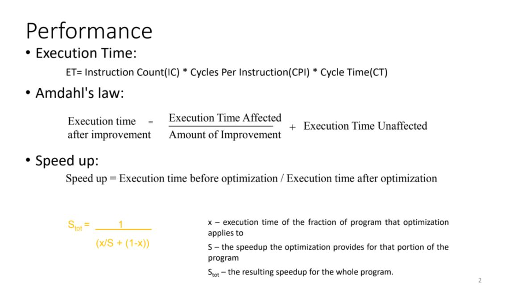
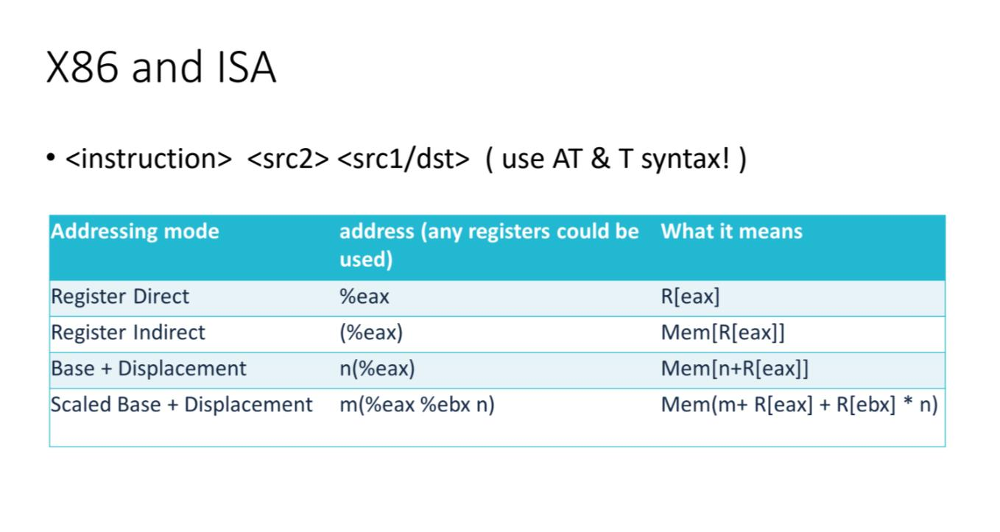
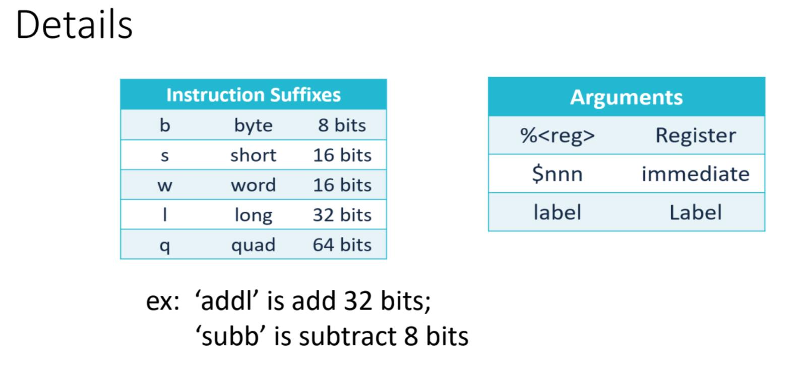
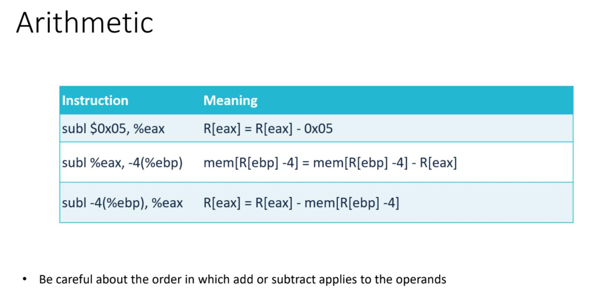
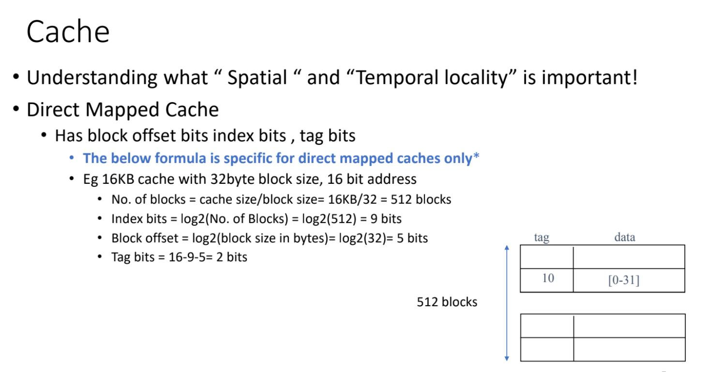
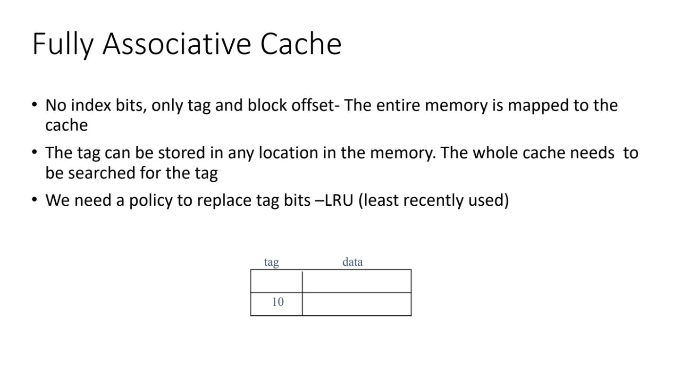

# 10/12 Discussion

## Basic formulas

## X86 Basics

## RBP, RSP

## Arithmetic

## Cache

## Fully Associative Cache

## Misses

Compulsory (or cold-start) misses

- first access to the data.

Capacity misses

- we missed only because the cache isn’t big enough.
- Defn: The address has already been requested AND a fully associative cache of the same size
  would also experience a miss

Conflict misses

- we missed because of the indexing scheme/addresses caused one block to evict another
  earlier than one might hope
- Defn: The address has already been requested AND a fully associative cache of the same size
  would experience a hit
